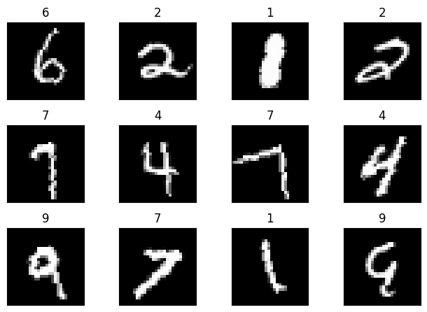
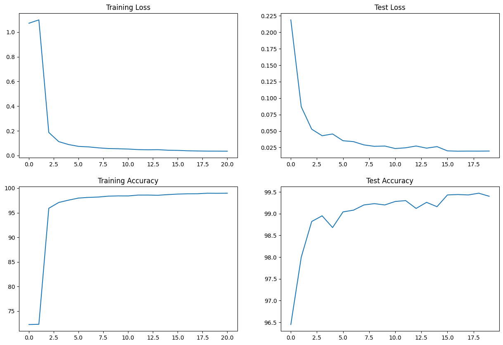

# MNIST Digit classification - Pytorch

## Description
Pytorch code to do MNIST digit classification using custom CNN from scratch.

## Project structure

```
ERA/Session_5
├── README.md -----> Details about the folder.
├── S5.ipynb ------> Visualization, code execution.
├── models.py -----> File which contains custom NN.
├── utils.py -------> Helper functions.
```

## Installation

First install all necessary dependencies.

```bash
git clone https://github.com/vivekmse0205/ERA.git
git fetch origin
git checkout master
cd Session_5
virtualenv -p python3 venv
source venv/bin/activate
pip install -r requirements.txt
```


## Usage

To train the model - Execute the jupyter notebook *S5.ipynb*

## Sample Batch



## Train/Val Metrics

