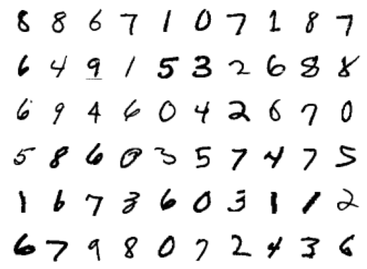
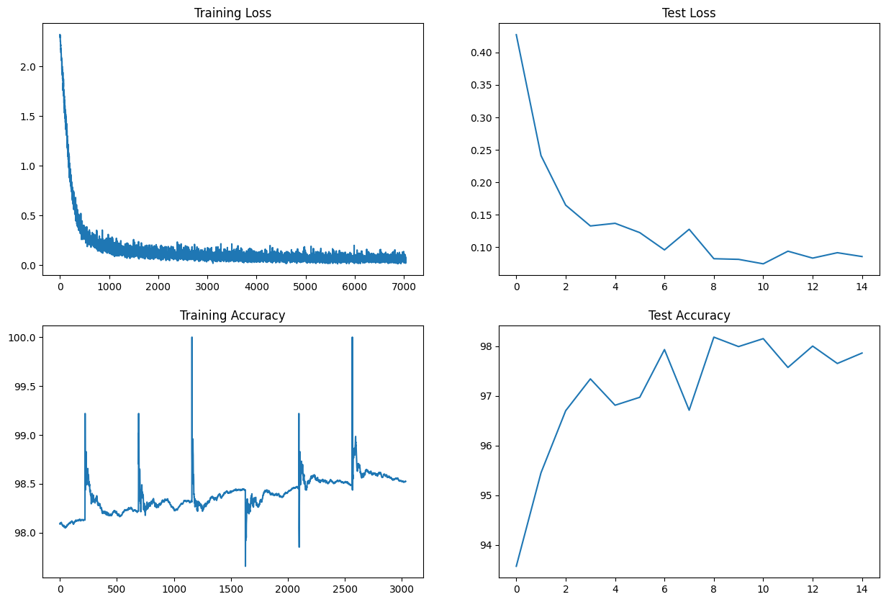

# Problem Statement
- Achieve 99.4% accuracy consistently in the last few epochs
- Complete training in less than or equal to 15 epochs
- Limit the number of parameters to less than 8000


## Project structure

```
ERA/session_7/
├── src/
│   ├── data/ -----> Location to store image data
│   ├── helpers/ ----> Utils functions
│   ├── models/ -----> Location of model Arch
│   └── notebooks/ ----> Contains experiments
└── resources/

```

## Installation

First install all necessary dependencies.

```bash
git clone https://github.com/vivekmse0205/ERA.git
git fetch origin
git checkout master
cd session_7
virtualenv -p python3 venv
source venv/bin/activate
pip install -r requirements.txt
```


## Usage

To train the model - Execute the jupyter notebook *experiment_num.ipynb*

## Sample Batch



## Train/Val Metrics

