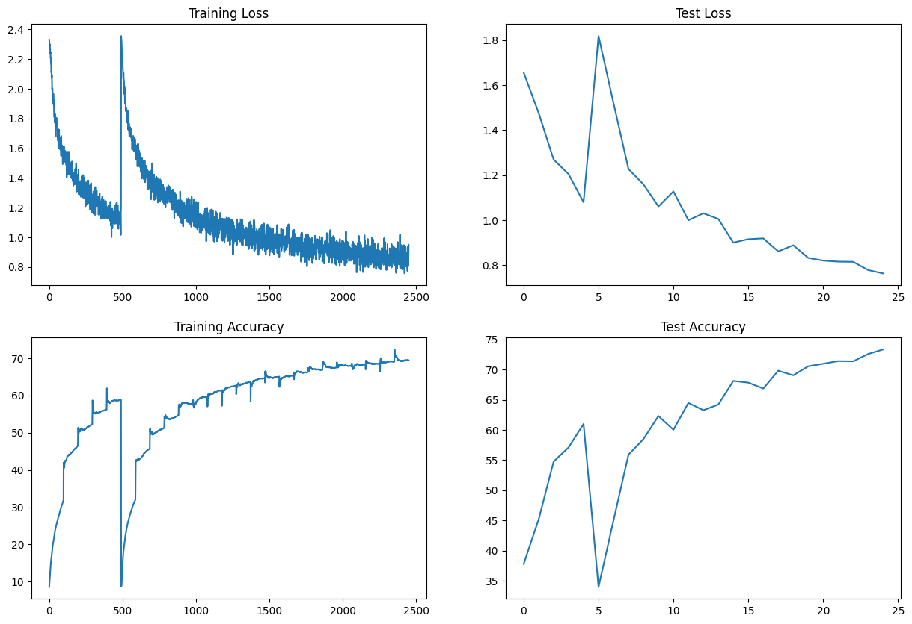
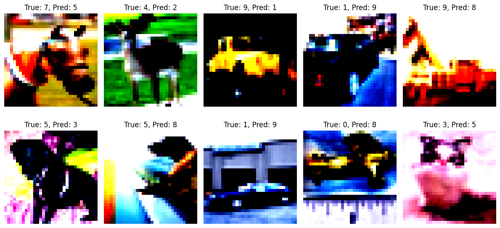
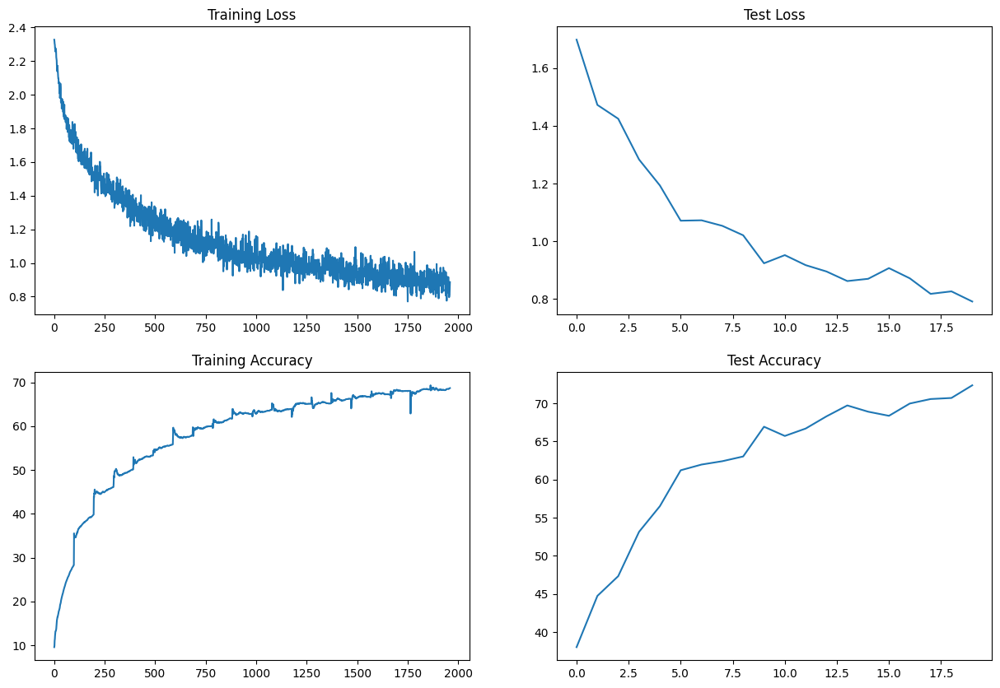
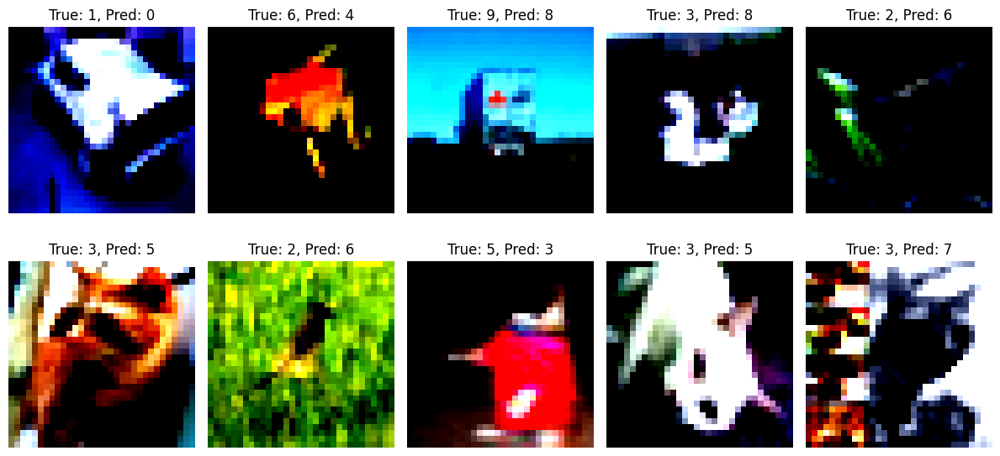

# Problem Statement
- Design a CNN architecture meeting the following constraints:
  - Architecture: C1 C2 C3 P1 C4 C5 C6 C7 P2 C8 C9 C10 GAP C11
  - Each layer with 1x1 convolution should be denoted as cN.
  - The total number of parameters should be less than 50,000.
  - Model with Batch Normalization (BN)
  - Model with Group Normalization (GN)
  - Model with Layer Normalization (LN)
- Train the models for a maximum of 20 epochs.
- Find 10 misclassified images for each of the BN, GN, and LN models, and display them as a 5x2 image matrix in three separate annotated images.


## Project structure

```
ERA/session_8/
├── src/
│   ├── data/ -----> Location to store image data
│   ├── helpers/ ----> Utils functions
│   ├── models/ -----> Location of model Arch
│   └── notebooks/ ----> Contains experiments
└── resources/

```

## Installation

First install all necessary dependencies.

```bash
git clone https://github.com/vivekmse0205/ERA.git
git fetch origin
git checkout master
cd session_8
virtualenv -p python3 venv
source venv/bin/activate
pip install -r requirements.txt
```


## Usage

To train the model - Execute the jupyter notebook *expnum_normalizationtype.ipynb*

## Findings of Batch norm

In Batch norm after some iterations there is a dip in train accuracy and again it improves.





## Findings of Layer norm

In Layer norm train acc remains constant but the number of trainable params increases to 200K


## Findings of Group norm

In Group norm, the param remains close to model with Batch norm. In terms of acc after 20 epochs its close to model with batch norm.


