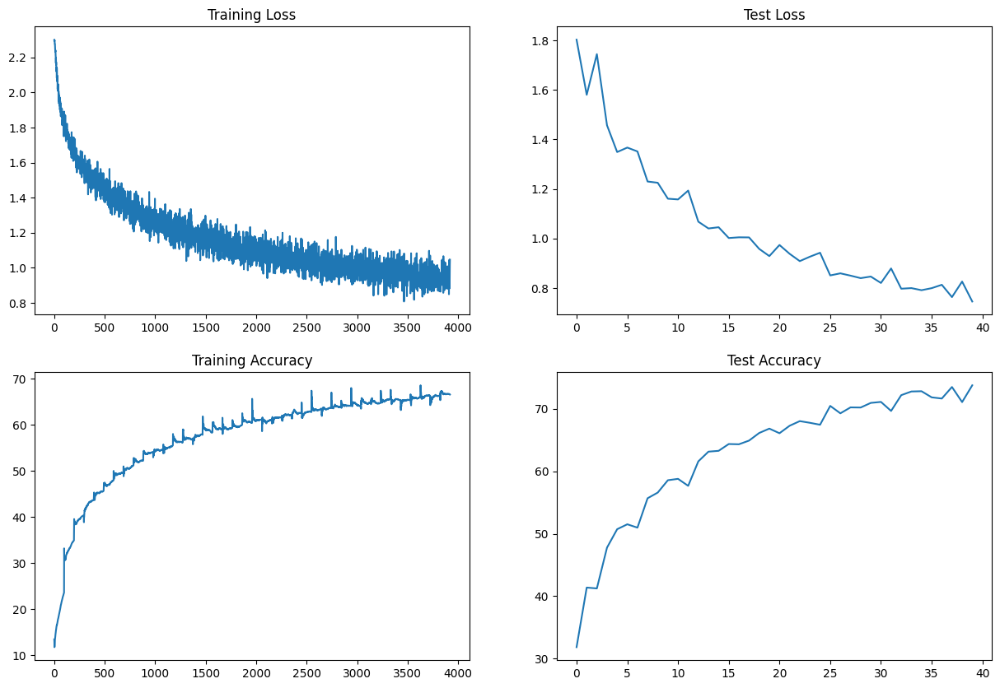

# Problem Statement

### Task:
Design a convolutional neural network (CNN) architecture with the following specifications:

1. Architecture:
   - Consists of convolutional layers denoted as C1, C2, C3, and C4.
   - One of the layers must use Depthwise Separable Convolution.
   - One of the layers must use Dilated Convolution.
   - use GAP (compulsory):- add FC after GAP to target #of classes (optional) 
   - use albumentation library and apply:
      horizontal flip
      shiftScaleRotate
      coarseDropout (max_holes = 1, max_height=16px, max_width=16, min_holes = 1, min_height=16px, min_width=16px, fill_value=(mean of your dataset), mask_fill_value = None)
    - achieve 85% accuracy, as many epochs as you want. Total Params to be less than 200k.


## Project structure

```
ERA/session_9/
├── src/
│   ├── data/ -----> Location to store image data
│   ├── helpers/ ----> Utils functions
│   ├── models/ -----> Location of model Arch
│   └── notebooks/ ----> Contains experiments
└── resources/

```

## Installation

First install all necessary dependencies.

```bash
git clone https://github.com/vivekmse0205/ERA.git
git fetch origin
git checkout master
cd session_9
virtualenv -p python3 venv
source venv/bin/activate
pip install -r requirements.txt
```


## Usage

To train the model - Execute the jupyter notebook *session_9.ipynb*

## Logs



